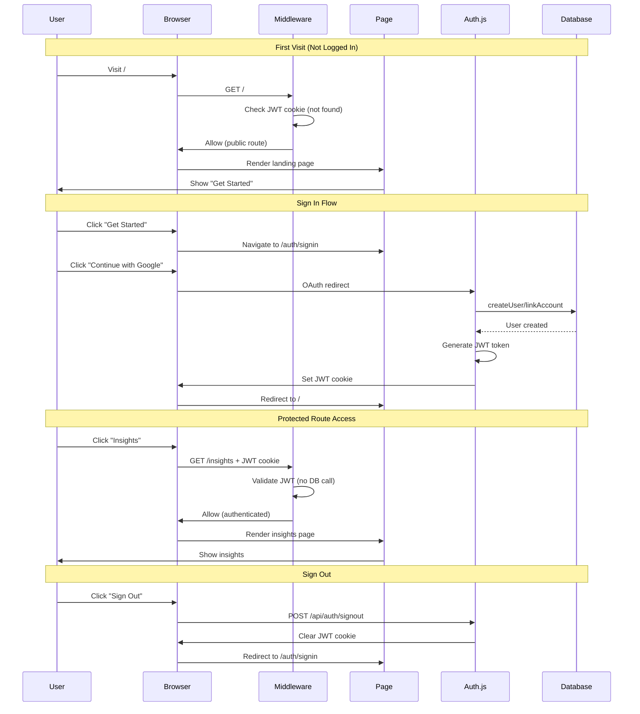

# Phase 2: JWT Session Fix - Edge Runtime Compatibility

## Issue: Edge Runtime Cannot Access Database

**Error in Terminal:**
```
[auth][error] AdapterError
[auth][cause]: Error: The edge runtime does not support Node.js 'net' module.
at getSessionAndUser (webpack-internal:///(middleware)/./lib/auth/config.ts:103:33)
```

**What Happened:**
1. ✅ Successfully signed in with Google OAuth
2. ✅ Home page loaded correctly
3. ❌ Clicked "Insights" button → Redirected back to sign-in
4. ❌ App froze in infinite redirect loop
5. ❌ Terminal showed repeated Edge Runtime errors

---

## Root Cause

### The Problem with Database Sessions

Next.js middleware runs in **Edge Runtime** by default, which is a lightweight JavaScript environment that:
- ✅ Runs on CDN edge nodes (fast, globally distributed)
- ✅ Has low latency and cold start times
- ❌ **Does NOT support Node.js modules** like `net`, `fs`, `child_process`

**Our setup was:**
- Using `strategy: "database"` for sessions
- Session validation required database queries
- Database queries use `postgres` library
- `postgres` library requires Node.js `net` module (TCP sockets)
- **Middleware → auth() → getSessionAndUser() → postgres → CRASH**

### Why It Only Failed on Protected Routes

| Route | Middleware Check | Result |
|-------|-----------------|--------|
| `/` (home) | ✅ Public route | No auth check, works fine |
| `/auth/signin` | ✅ Public route | No auth check, works fine |
| `/api/auth/callback/google` | ✅ API route (Node.js) | Works in Node.js runtime |
| `/insights` | ❌ Protected route | Middleware checks auth → Edge Runtime crash |
| `/entries/new` | ❌ Protected route | Middleware checks auth → Edge Runtime crash |

**Result:** Could sign in successfully, but couldn't navigate to any protected pages.

---

## Solution: JWT Sessions

Changed from **database sessions** to **JWT (JSON Web Token) sessions**.

### What Changed in `lib/auth/config.ts`

#### 1. Removed Database Session Methods

**Deleted these adapter methods (no longer needed with JWT):**
- `createSession()` - JWT stored in cookie, not database
- `getSessionAndUser()` - JWT validated cryptographically, not via database
- `updateSession()` - JWT expiry built into token
- `deleteSession()` - Handled by clearing cookie

**Kept these adapter methods (still needed for OAuth):**
- `createUser()` - User records still stored in database
- `getUser()` - Used during OAuth callback
- `getUserByEmail()` - Used during OAuth callback
- `getUserByAccount()` - Links OAuth provider to user
- `updateUser()` - Updates user profile
- `linkAccount()` - Stores OAuth credentials

#### 2. Changed Session Strategy

**Before:**
```typescript
session: {
  strategy: "database",
}
```

**After:**
```typescript
session: {
  strategy: "jwt",
}
```

#### 3. Updated Callbacks

**Before (database sessions):**
```typescript
callbacks: {
  session({ session, user }) {
    if (session.user) {
      session.user.id = user.id;
    }
    return session;
  },
}
```

**After (JWT sessions):**
```typescript
callbacks: {
  async jwt({ token, user }) {
    // Add user ID to JWT token on sign-in
    if (user) {
      token.id = user.id;
    }
    return token;
  },
  session({ session, token }) {
    // Add user ID from JWT to session
    if (session.user) {
      session.user.id = token.id as string;
    }
    return session;
  },
}
```

**How this works:**
1. On sign-in: User data added to JWT token
2. On each request: Token decoded, user ID extracted
3. In your code: `session.user.id` works exactly the same

---

## How JWT Sessions Work

### Sign-In Flow

```
1. User clicks "Continue with Google"
2. Google OAuth redirects back with code
3. Auth.js exchanges code for user info
4. Adapter creates/updates user in database
5. Auth.js generates JWT token with user.id
6. JWT stored in encrypted HTTP-only cookie
7. User redirected to home page
```

### Protected Route Access

```
1. User clicks "Insights"
2. Middleware intercepts request (runs in Edge Runtime)
3. Reads JWT from cookie
4. Validates JWT signature (NO DATABASE CALL)
5. Decodes user.id from token
6. Access granted → Insights page loads
```

### Sign-Out Flow

```
1. User clicks "Sign Out"
2. JWT cookie deleted
3. User redirected to sign-in page
```

---

## Key Differences: Database vs JWT Sessions

| Feature | Database Sessions | JWT Sessions |
|---------|------------------|--------------|
| **Storage** | Postgres `sessions` table | Encrypted cookie |
| **Validation** | Database query per request | Cryptographic signature |
| **Edge Compatible** | ❌ No (requires Node.js) | ✅ Yes (no database needed) |
| **Revocation** | ✅ Instant (delete from DB) | ❌ Must wait for expiry |
| **Performance** | Slower (DB query) | Faster (local validation) |
| **Cookie Size** | Small (just session token) | Larger (full user data) |
| **Security** | High (server-side) | High (signed tokens) |

---

## Security Considerations

### Is JWT Secure Enough?

**Yes, for Hey Bagel because:**

1. ✅ **Signed tokens** - Can't be tampered with (uses `NEXTAUTH_SECRET`)
2. ✅ **HTTP-only cookies** - JavaScript can't access them (XSS protection)
3. ✅ **Encrypted** - Token contents encrypted before storage
4. ✅ **Expiry built-in** - Tokens expire automatically (default: 30 days)
5. ✅ **Secure flag in production** - Only sent over HTTPS

### What About Session Revocation?

**Database sessions:** Can delete session from DB immediately (instant logout)  
**JWT sessions:** Must wait for token to expire (or user manually signs out)

**For a journaling app:**
- Not dealing with banking/financial data
- Users control their own account
- Manual sign-out available anytime
- Token expiry is sufficient protection

**If you needed instant revocation later:**
- Add JWT token ID to a blocklist table
- Check blocklist in middleware (but this defeats the purpose of JWT)
- Or use database sessions on Node.js runtime (Option 2 from earlier)

---

## Testing the Fix

### Test 1: Sign In and Navigate

1. **Visit:** `http://localhost:3000`
2. **Click:** "Get Started"
3. **Sign in with Google**
4. **Verify:** Home page loads with navigation
5. **Click:** "Insights" → Should load WITHOUT redirect ✅
6. **Click:** "New Entry" → Should load WITHOUT redirect ✅
7. **Click:** Home → Should work ✅
8. **Refresh page** → Should stay logged in ✅

### Test 2: Session Persistence

1. Sign in successfully
2. Close browser completely
3. Reopen browser
4. Visit `http://localhost:3000`
5. **Should still be logged in** ✅
6. Navigate to Insights/New Entry → Works ✅

### Test 3: Sign Out

1. Click "Sign Out" in UserMenu
2. **Should redirect to sign-in page** ✅
3. Navigation buttons should disappear ✅
4. Try to visit `/insights` directly
5. **Should redirect to sign-in** ✅

### Test 4: Multiple Users (Data Isolation)

1. Sign in as User A
2. Create a test entry
3. Sign out
4. Sign in as User B (different Google account)
5. **Should NOT see User A's entries** ✅
6. Create entry as User B
7. Sign out and sign back in as User A
8. **Should only see User A's entries** ✅

---

## Auth Flow Diagram (After Fix)



---

## What About the Sessions Table?

**Q:** We created a `sessions` table in the database. Do we still need it?

**A:** No, it won't be used with JWT sessions. But it's harmless to leave it there.

**Options:**
1. **Leave it** - No harm, and you can switch back to database sessions if needed
2. **Drop it** - Run `DROP TABLE sessions;` in Neon Console if you want to clean up

**The adapter methods we removed:**
- These were only for database session management
- They're not part of the OAuth flow
- Removing them doesn't break anything

---

## Environment Variables (No Changes)

Your `.env.local` remains the same:
```bash
DATABASE_URL=postgresql://...
OPENAI_API_KEY=sk-...
NEXTAUTH_URL=http://localhost:3000
NEXTAUTH_SECRET=<your-secret>
GOOGLE_CLIENT_ID=<your-client-id>
GOOGLE_CLIENT_SECRET=<your-client-secret>
```

The `NEXTAUTH_SECRET` is now used to sign JWT tokens instead of encrypting session tokens.

---

## Success Criteria

Phase 2 Auth is NOW truly complete when:

- ✅ Dependencies installed
- ✅ Database schema with users and accounts tables
- ✅ Custom adapter with OAuth support
- ✅ JWT sessions (Edge Runtime compatible)
- ✅ Sign-in page functional
- ✅ Middleware protecting routes
- ✅ Navigation hidden when logged out
- ✅ UserMenu visible when logged in
- ✅ All Server Actions using `requireAuth()`
- ✅ **OAuth completes successfully**
- ✅ **Can navigate to protected routes WITHOUT re-login**
- ✅ **No Edge Runtime errors**
- ✅ **Sessions persist across refreshes**
- ✅ **Data isolation between users**

---

## Deployment Notes (For Later)

When deploying to Vercel:
- ✅ JWT sessions work perfectly on Vercel Edge
- ✅ Middleware will run globally on edge nodes (fast!)
- ✅ No cold start delays
- ✅ Update `NEXTAUTH_URL` to production domain
- ✅ Add production callback URL to Google OAuth

---

## Troubleshooting

### Still getting Edge Runtime errors?

1. Restart dev server: `Ctrl+C`, then `npm run dev`
2. Clear browser cookies for localhost
3. Clear Next.js cache: `rm -rf .next`
4. Verify `strategy: "jwt"` in auth config

### JWT token too large?

JWT tokens are stored in cookies (4KB limit). Our setup is minimal:
- Just stores user ID
- Well under limit
- If you add more data to JWT, keep it small

### Need to revoke sessions immediately?

Switch back to database sessions and use Node.js runtime for middleware (add `export const runtime = "nodejs"` to `middleware.ts`).

---

**Fix applied by:** AI Assistant  
**Date:** January 4, 2026  
**Fix type:** JWT sessions for Edge Runtime compatibility  
**Status:** Ready for testing  
**Estimated test time:** 3-5 minutes


