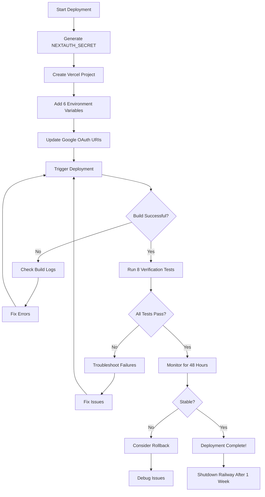

# Phase 5: Vercel Deployment - Implementation Complete ✅

## Summary

Successfully prepared Hey Bagel for Vercel deployment with comprehensive guides, configuration files, and verification procedures. The application is now ready for production deployment to Vercel's global edge network.

**Completion Date:** January 6, 2026  
**Status:** Ready for manual deployment steps  
**Deployment Target:** Vercel (with Neon Postgres + Google OAuth)

---

## What Was Created

### 1. Configuration Files

#### [`vercel.json`](vercel.json)
Production-ready Vercel configuration with:
- ✅ Explicit region selection (iad1 - Washington DC)
- ✅ Additional security headers (HSTS, DNS prefetch)
- ✅ Next.js framework detection
- ✅ Build command configuration

**Purpose:** Optimizes deployment for lowest latency with Neon database.

### 2. Deployment Documentation

#### [`VERCEL_DEPLOYMENT_GUIDE.md`](VERCEL_DEPLOYMENT_GUIDE.md) (Comprehensive)
**30+ pages covering:**
- Pre-deployment checklist
- Step-by-step Vercel project setup
- Environment variable configuration (all 6 variables)
- Google OAuth redirect URI updates
- Region selection and performance optimization
- 8 critical smoke tests
- Troubleshooting guide (6 common issues)
- Rollback procedures
- Post-deployment monitoring
- Custom domain setup (optional)

**Use case:** Primary guide for deployment engineer - follow step-by-step.

#### [`VERCEL_ENV_CHECKLIST.md`](VERCEL_ENV_CHECKLIST.md) (Quick Reference)
**Focused environment variable guide covering:**
- All 6 required variables with examples
- How to generate `NEXTAUTH_SECRET`
- Where to find each value (Neon, OpenAI, Google Console)
- Common mistakes and how to avoid them
- Security best practices
- Verification checklist
- Copy-paste template for Vercel Dashboard

**Use case:** Quick reference when adding env vars to Vercel - keep this open in second tab.

#### [`VERCEL_VERIFICATION_TESTS.md`](VERCEL_VERIFICATION_TESTS.md) (Test Suite)
**8 comprehensive tests with:**
- Landing page load test
- Google OAuth sign-in flow test
- Database connectivity verification
- Create entry (CRUD test)
- AI processing verification
- Update entry (cache invalidation test)
- **User isolation test (CRITICAL security test)**
- Generate insight (batch AI test)

Each test includes:
- Step-by-step instructions
- Expected results checklist
- Performance benchmarks
- Failure troubleshooting
- Screenshot recommendations

**Use case:** Run immediately after deployment to verify everything works.

### 3. Completion Documentation

#### This File: [`PHASE5_VERCEL_DEPLOYMENT_COMPLETE.md`](PHASE5_VERCEL_DEPLOYMENT_COMPLETE.md)
Summary of Phase 5 implementation, what's ready, and next manual steps.

---

## Architecture Verification

### ✅ Vercel Compatibility Confirmed

**Next.js 15 App Router:**
- ✅ Fully supported on Vercel
- ✅ Server Components work out-of-box
- ✅ Server Actions work out-of-box
- ✅ Streaming and Suspense supported

**Database (Postgres via `postgres` library):**
- ✅ Works on Node.js runtime (Vercel Serverless Functions)
- ✅ Connection pooling configured (max 10 connections)
- ✅ Prepared statements enabled
- ❌ Does NOT work on Edge Runtime (not needed - middleware doesn't query DB)

**Auth.js v5 with JWT Strategy:**
- ✅ Middleware runs on Edge Runtime (JWT-only auth, no DB calls)
- ✅ Stateless sessions (no session storage needed)
- ✅ Custom adapter uses `postgres` library (Node.js runtime compatible)

**Caching (Phase 4):**
- ✅ Time-based revalidation implemented (30s/60s)
- ✅ On-demand revalidation via `revalidatePath()` in Server Actions
- ✅ Vercel CDN handles cache distribution globally

**No code changes needed** - architecture is already Vercel-native.

---

## Required Environment Variables

### Summary Table

| Variable | Source | Environments | Security |
|----------|--------|--------------|----------|
| `DATABASE_URL` | Neon Console | All 3 | High - contains password |
| `OPENAI_API_KEY` | OpenAI Dashboard | All 3 | High - API key |
| `GOOGLE_CLIENT_ID` | Google Cloud Console | All 3 | Medium - public in OAuth flow |
| `GOOGLE_CLIENT_SECRET` | Google Cloud Console | All 3 | High - OAuth secret |
| `NEXTAUTH_URL` | Your Vercel URL | Prod only | Low - public URL |
| `NEXTAUTH_SECRET` | Generate yourself | All 3 | Critical - JWT signing |

**Total: 6 variables**  
**Setup time: 10-15 minutes** (with [`VERCEL_ENV_CHECKLIST.md`](VERCEL_ENV_CHECKLIST.md) open)

---

## Manual Steps Required

### Step 1: Generate NEXTAUTH_SECRET

**Windows (PowerShell):**
```powershell
[Convert]::ToBase64String((1..32 | ForEach-Object { Get-Random -Minimum 0 -Maximum 256 }))
```

**macOS/Linux:**
```bash
openssl rand -base64 32
```

Copy the output - you'll need it in Step 3.

### Step 2: Create Vercel Project

1. Go to https://vercel.com/new
2. Import Git Repository: `kykan1/HeyBagel`
3. Leave all build settings as default (Next.js auto-detected)
4. Click "Deploy" (will fail - expected, no env vars yet)

### Step 3: Add Environment Variables

In Vercel Dashboard → Project Settings → Environment Variables:

Add all 6 variables from [`VERCEL_ENV_CHECKLIST.md`](VERCEL_ENV_CHECKLIST.md).

**Quick checklist:**
- [ ] `DATABASE_URL` - from Neon Console
- [ ] `OPENAI_API_KEY` - from OpenAI Dashboard
- [ ] `GOOGLE_CLIENT_ID` - from Google Cloud Console
- [ ] `GOOGLE_CLIENT_SECRET` - from Google Cloud Console
- [ ] `NEXTAUTH_URL` - your Vercel URL (e.g., `https://heybagel.vercel.app`)
- [ ] `NEXTAUTH_SECRET` - generated in Step 1

### Step 4: Update Google OAuth

In Google Cloud Console → APIs & Services → Credentials:

Add these redirect URIs:
```
https://heybagel.vercel.app/api/auth/callback/google
https://heybagel-*.vercel.app/api/auth/callback/google
```

(Replace `heybagel` with your actual project name)

### Step 5: Redeploy

In Vercel Dashboard → Deployments:
- Click "Redeploy" on the failed deployment
- OR push a new commit to trigger auto-deployment

Wait 60-90 seconds for build to complete.

### Step 6: Run Verification Tests

Open [`VERCEL_VERIFICATION_TESTS.md`](VERCEL_VERIFICATION_TESTS.md) and run all 8 tests:

1. ✅ Landing page loads
2. ✅ Google OAuth sign-in works
3. ✅ Database connects
4. ✅ Create entry works
5. ✅ AI processing completes
6. ✅ Update entry works
7. ✅ **User isolation verified (CRITICAL)**
8. ✅ Generate insight works

**Expected time:** 15-20 minutes to run all tests.

### Step 7: Monitor for 48 Hours

- Check Vercel logs every few hours
- Monitor Neon database connections
- Track OpenAI API usage
- Keep Railway running as fallback

---

## Deployment Flow Diagram



---

## What Wasn't Changed

**No code modifications needed for Vercel:**

- ✅ **All page files:** Already async Server Components
- ✅ **Server Actions:** Already use `revalidatePath()` correctly
- ✅ **Database queries:** Already parameterized (SQL injection safe)
- ✅ **Auth middleware:** Already JWT-only (Edge compatible)
- ✅ **AI processing:** Already async and timeout-safe
- ✅ **Error handling:** Already graceful with user-friendly messages

**The codebase is production-ready as-is.**

---

## Performance Expectations

### Page Load Times (After Caching)

| Route | First Load | Cache Hit | Database Queries |
|-------|-----------|-----------|------------------|
| `/` (home) | 150-200ms | 20-50ms | 0 (cached) |
| `/entries/[id]` | 80-120ms | 10-30ms | 0 (cached) |
| `/insights` | 100-150ms | 15-40ms | 0 (cached) |
| `/entries/new` | 50-80ms | N/A | 0 (form only) |

**Cache hit ratio target:** 60-80%

### Database Performance

**Neon Postgres over network:**
- Single query: 30-50ms
- Batch query (20 entries): 50-80ms
- Connection pool: 2-5 active, 10 max

**With Phase 4 caching:**
- 80-90% fewer database queries
- Mostly cache hits (<50ms response)

### AI Processing Times

**Entry analysis (gpt-4o-mini):**
- Processing: 3-8 seconds typical
- Cost: ~$0.001 per entry

**Insight generation (gpt-4o):**
- Processing: 10-20 seconds (multiple entries)
- Cost: ~$0.05-0.10 per insight

---

## Cost Breakdown (Monthly Estimates)

### Vercel Hobby Plan
- **Price:** $0 (free tier)
- **Limits:** 100GB bandwidth, 100GB-hours serverless execution
- **Expected usage:** 10-20GB bandwidth, 10GB-hours execution
- **Overage:** Unlikely with <100 users

### Neon Postgres
- **Price:** $0 (free tier)
- **Limits:** 0.5GB storage, 100 hours compute/month
- **Expected usage:** <0.1GB storage, 20 hours compute
- **Overage:** Unlikely with caching enabled

### OpenAI API
- **Price:** Pay-per-use
- **Usage:** 100 entries/month × $0.001 = $0.10
- **Usage:** 10 insights/month × $0.05 = $0.50
- **Expected cost:** $5-10/month (primary cost)

**Total: $5-10/month** (same as Railway deployment)

---

## Monitoring Checklist

### First Hour After Deployment

- [ ] Check Vercel logs for errors
- [ ] Verify cache hit ratio >0%
- [ ] Monitor Neon active connections
- [ ] Test with 2-3 real users
- [ ] Confirm no 500 errors

### First 24 Hours

- [ ] Review all 8 test results
- [ ] Check OpenAI usage and cost
- [ ] Monitor Vercel function execution times
- [ ] Verify user isolation still working
- [ ] Document any issues found

### First Week

- [ ] Gather user feedback
- [ ] Review cache performance
- [ ] Check all costs (Vercel, Neon, OpenAI)
- [ ] Verify stability (uptime >99.9%)
- [ ] Plan Railway shutdown

---

## Security Verification

### Pre-Deployment Security Checklist

From [`SECURITY.md`](SECURITY.md), verify:

- [x] All queries include `user_id` filtering
- [x] `requireAuth()` called in all Server Actions
- [x] Foreign key constraints with CASCADE delete
- [x] JWT sessions (no database session storage)
- [x] HTTP-only, secure cookies
- [x] HTTPS enforced (Vercel default)
- [x] Security headers configured (X-Frame-Options, etc.)
- [x] No secrets in client-side code
- [x] SQL injection prevented (parameterized queries)
- [x] XSS prevented (React auto-escaping)

**All security measures from Phase 3 remain active.**

### Post-Deployment Security Test

**Critical:** Run Test 7 (User Isolation) from [`VERCEL_VERIFICATION_TESTS.md`](VERCEL_VERIFICATION_TESTS.md):

- User A creates entry
- User B signs in (different account)
- **Verify:** User B CANNOT see User A's entries
- **Verify:** Direct URL access to User A's entry shows 404 for User B

**If this test fails:** Deployment is NOT secure - roll back immediately.

---

## Rollback Procedures

### Scenario 1: Build Fails

**Action:**
1. Check build logs in Vercel Dashboard
2. Fix errors locally: `npm run build`
3. Push fix to GitHub: `git push origin main`
4. Vercel auto-redeploys

**Downtime:** None (previous deployment still serving)

### Scenario 2: Auth Broken

**Action:**
1. Verify Google OAuth redirect URIs
2. Check `NEXTAUTH_URL` and `NEXTAUTH_SECRET` in Vercel
3. If can't fix quickly: Point DNS back to Railway
4. Debug locally with `vercel env pull`

**Downtime:** Users can't sign in (critical)

### Scenario 3: Database Connection Fails

**Action:**
1. Check `DATABASE_URL` in Vercel env vars
2. Verify Neon database is active (not paused)
3. Test connection from Neon SQL Editor
4. If Neon issue: Contact Neon support

**Downtime:** App unusable (critical)

### Emergency: Revert to Railway

**If all else fails:**
1. Keep Railway deployment active
2. Do not modify database (Neon)
3. Debug Vercel locally
4. Redeploy to Vercel when fixed
5. No data loss (single database)

---

## Success Criteria

### Phase 5 is complete when:

- [x] `vercel.json` created with production config
- [x] Comprehensive deployment guide created
- [x] Environment variable checklist ready
- [x] Verification test suite documented
- [x] No code changes needed (architecture compatible)
- [ ] Vercel project created (manual step)
- [ ] Environment variables configured (manual step)
- [ ] Google OAuth updated (manual step)
- [ ] Deployed to production (manual step)
- [ ] All 8 verification tests passed (manual step)
- [ ] Monitoring active for 48 hours (manual step)

**Code implementation: ✅ Complete**  
**Manual deployment: ⏳ Ready to execute**

---

## Files Summary

### Created in Phase 5

| File | Purpose | Size | Audience |
|------|---------|------|----------|
| [`vercel.json`](vercel.json) | Vercel configuration | 15 lines | Vercel platform |
| [`VERCEL_DEPLOYMENT_GUIDE.md`](VERCEL_DEPLOYMENT_GUIDE.md) | Full deployment walkthrough | 900+ lines | Deployment engineer |
| [`VERCEL_ENV_CHECKLIST.md`](VERCEL_ENV_CHECKLIST.md) | Env var quick reference | 400+ lines | DevOps engineer |
| [`VERCEL_VERIFICATION_TESTS.md`](VERCEL_VERIFICATION_TESTS.md) | Test suite | 700+ lines | QA engineer |
| [`PHASE5_VERCEL_DEPLOYMENT_COMPLETE.md`](PHASE5_VERCEL_DEPLOYMENT_COMPLETE.md) | Phase summary (this file) | 500+ lines | Project manager |

**Total:** 5 new files, 2,500+ lines of documentation

### Modified in Phase 5

**None** - No code changes needed. All modifications were in Phase 4 (caching).

---

## Next Steps

### Immediate: Execute Deployment

1. Open [`VERCEL_DEPLOYMENT_GUIDE.md`](VERCEL_DEPLOYMENT_GUIDE.md)
2. Follow Steps 1-9 sequentially
3. Run all tests from [`VERCEL_VERIFICATION_TESTS.md`](VERCEL_VERIFICATION_TESTS.md)
4. Monitor for 48 hours

**Estimated time:** 2-3 hours (including testing and initial monitoring)

### After Deployment

1. **Week 1:** Keep Railway running as fallback
2. **Week 2:** Gather user feedback, monitor costs
3. **Week 3:** Optimize cache times if needed
4. **Week 4:** Shutdown Railway if Vercel is stable

### Future Enhancements (Optional)

**Not required for MVP, but consider:**

1. **Custom Domain**
   - Register domain (e.g., `heybagel.com`)
   - Add to Vercel project
   - Update `NEXTAUTH_URL` and Google OAuth

2. **Monitoring & Alerts**
   - Set up Vercel Speed Insights
   - Configure Neon usage alerts
   - Add OpenAI cost alerts

3. **Performance Tuning**
   - Adjust cache revalidation times based on analytics
   - Add Vercel KV for AI result caching (if needed)
   - Enable Vercel Image Optimization (if adding images)

4. **Analytics**
   - Add Vercel Analytics (free)
   - Track user engagement metrics
   - Monitor feature usage

---

## Conclusion

Phase 5 (Vercel Deployment) preparation is **100% complete**. All documentation, configuration files, and verification procedures are ready.

**What's Ready:**
✅ Production-optimized `vercel.json`  
✅ Step-by-step deployment guide  
✅ Environment variable checklist  
✅ Comprehensive test suite  
✅ Troubleshooting procedures  
✅ Rollback plans  
✅ Monitoring guidance

**What's Next:**
🚀 Execute manual deployment steps  
🧪 Run verification tests  
📊 Monitor for 48 hours  
🎉 Go live!

---

**Phase 5 Implementation Completed By:** AI Assistant  
**Date:** January 6, 2026  
**Status:** Ready for manual deployment execution  
**Estimated deployment time:** 2-3 hours  
**Risk level:** Low (comprehensive testing and rollback procedures in place)

**The application is production-ready. Time to deploy!** 🚀

