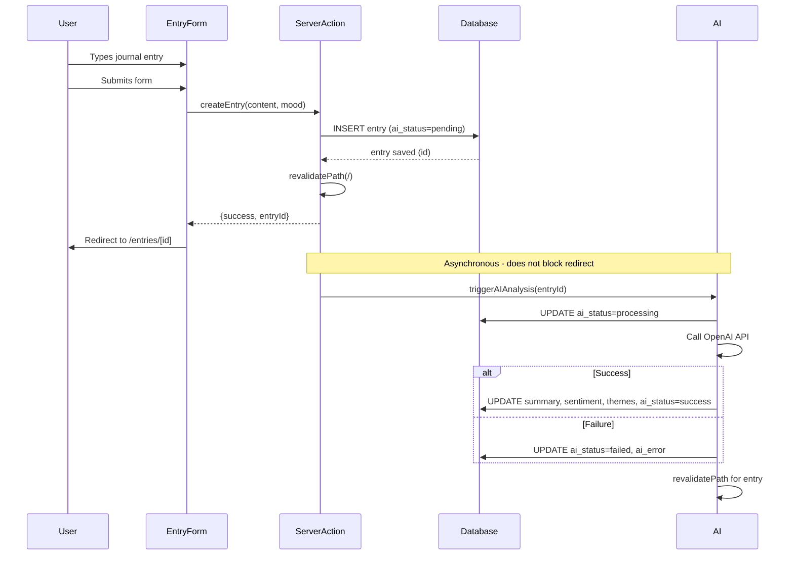
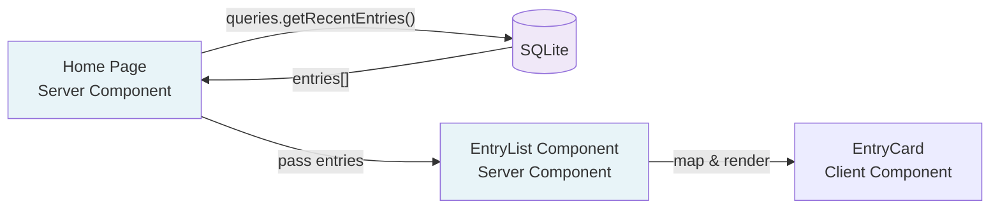
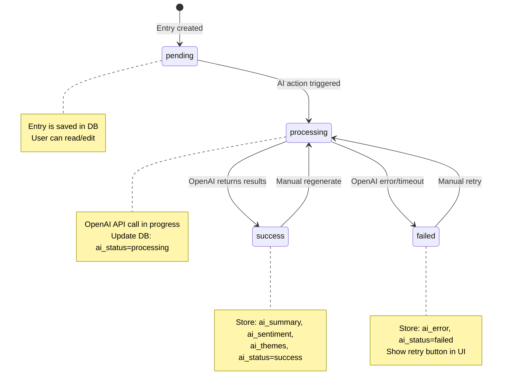

# Hey Bagel MVP Implementation Plan

## 1. Project Structure

```
HeyBagel/
├── src/
│   ├── app/
│   │   ├── layout.tsx                 # Root layout
│   │   ├── page.tsx                   # Home/dashboard (entry list)
│   │   ├── entries/
│   │   │   ├── new/
│   │   │   │   └── page.tsx           # New entry form
│   │   │   └── [id]/
│   │   │       └── page.tsx           # Single entry view
│   │   └── insights/
│   │       └── page.tsx               # Weekly/monthly reflections
│   ├── components/
│   │   ├── EntryList.tsx              # Server Component - entry list
│   │   ├── EntryCard.tsx              # Entry preview card
│   │   ├── EntryForm.tsx              # Client Component - form
│   │   ├── EntryDetail.tsx            # Server Component - single entry
│   │   ├── AIStatusBadge.tsx          # Show AI processing state
│   │   └── InsightPanel.tsx           # Display AI insights
│   ├── lib/
│   │   ├── db/
│   │   │   ├── client.ts              # SQLite connection singleton
│   │   │   ├── schema.ts              # Table schemas & migrations
│   │   │   └── queries.ts             # Database query functions
│   │   ├── ai/
│   │   │   ├── client.ts              # OpenAI client singleton
│   │   │   ├── entry-analysis.ts      # Single entry AI processing
│   │   │   └── batch-insights.ts      # Weekly/monthly reflections
│   │   └── utils/
│   │       ├── date.ts                # Date formatting
│   │       └── validation.ts          # Input validation schemas
│   ├── actions/
│   │   ├── entry-actions.ts           # Server Actions for entries
│   │   └── ai-actions.ts              # Server Actions for AI processing
│   └── types/
│       └── index.ts                   # TypeScript types
├── public/
├── .env.local                         # OpenAI API key
├── package.json
├── tailwind.config.ts
└── tsconfig.json
```

## 2. Database Schema

**entries table:**

```sql
CREATE TABLE entries (
  id TEXT PRIMARY KEY,
  user_id TEXT NOT NULL DEFAULT 'default_user',
  date TEXT NOT NULL,  -- ISO 8601 date
  content TEXT NOT NULL,
  mood TEXT,  -- optional: 'positive' | 'neutral' | 'negative' | 'mixed'
  ai_summary TEXT,
  ai_sentiment TEXT,  -- JSON: {score: number, label: string}
  ai_themes TEXT,  -- JSON array: ["theme1", "theme2"]
  ai_status TEXT NOT NULL DEFAULT 'pending',  -- 'pending' | 'processing' | 'success' | 'failed'
  ai_error TEXT,  -- Store error message if AI fails
  created_at TEXT NOT NULL,
  updated_at TEXT NOT NULL
);

CREATE INDEX idx_entries_date ON entries(date DESC);
CREATE INDEX idx_entries_ai_status ON entries(ai_status);
```

**insights table (for batch reflections):**

```sql
CREATE TABLE insights (
  id TEXT PRIMARY KEY,
  user_id TEXT NOT NULL DEFAULT 'default_user',
  insight_type TEXT NOT NULL,  -- 'weekly' | 'monthly'
  start_date TEXT NOT NULL,
  end_date TEXT NOT NULL,
  content TEXT,  -- AI-generated reflection
  themes TEXT,  -- JSON array of recurring themes
  sentiment_trend TEXT,  -- JSON: trend analysis
  ai_status TEXT NOT NULL DEFAULT 'pending',
  ai_error TEXT,
  created_at TEXT NOT NULL,
  updated_at TEXT NOT NULL
);

CREATE INDEX idx_insights_date ON insights(start_date DESC);
```

## 3. Data Flow: Creating an Entry



**Key Implementation Details:**

- `createEntry` Server Action writes to DB first
- Returns immediately with `entryId`
- Form redirects user to entry detail page
- AI processing happens in background via separate `processEntryAI` Server Action
- User can navigate away; AI completes asynchronously
- Entry detail page shows AI status badge (pending → processing → success/failed)

## 4. Data Flow: Viewing Entries



**Key Implementation Details:**

- Home page is a Server Component
- Reads from DB using `queries.getRecentEntries(limit: 20)`
- Cached by default (Next.js automatic caching)
- Each `EntryCard` shows:
  - Date
  - Content preview (first 150 chars)
  - Mood indicator
  - AI status badge
- Clicking card navigates to `/entries/[id]`

## 5. Data Flow: AI Processing Lifecycle



**Key Implementation Details:**

- AI never blocks user writes or reads
- Each state is persisted in `ai_status` column
- Entry detail page shows current state
- Failed states expose a "Retry" button that calls `retryAIAnalysis(entryId)`
- Success states can be regenerated via "Regenerate Insights" button

## 6. Caching & Revalidation Strategy

| Route | Caching | Revalidation Trigger |
|-------|---------|---------------------|
| `/` (home) | Cached | `revalidatePath('/')` after create/update entry |
| `/entries/[id]` | Cached | `revalidatePath(/entries/${id})` after AI completes |
| `/entries/new` | Not cached (form) | N/A |
| `/insights` | Cached | `revalidatePath('/insights')` after insight generated |

**Server Actions must call:**
- `createEntry` → `revalidatePath('/')`
- `updateEntry` → `revalidatePath('/'), revalidatePath(/entries/${id})`
- `processEntryAI` → `revalidatePath(/entries/${id})`
- `generateInsight` → `revalidatePath('/insights')`

## 7. AI Strategy

**Single Entry Analysis:**
- Model: `gpt-4o-mini` (fast, cheap)
- Inputs: entry content
- Outputs: summary (2-3 sentences), sentiment, themes (3-5 keywords)
- Cost: ~$0.001 per entry
- Timeout: 30s, fail gracefully

**Batch Insights (Weekly/Monthly):**
- Model: `gpt-4o` (more capable)
- Inputs: batch of 7-30 entries
- Outputs: longitudinal reflection (patterns, changes over time)
- Cost: ~$0.10 per insight
- User-triggered (button on `/insights` page)
- Store in `insights` table for reuse

**Error Handling:**
- Wrap OpenAI calls in try/catch
- Store errors in `ai_error` column
- Surface retry option in UI
- Log errors for debugging (console.error, not external service)

## 8. Implementation Sequence

### Phase 1: Foundation (Implement First)
1. **Database Setup**
   - `src/lib/db/client.ts`: SQLite connection with better-sqlite3
   - `src/lib/db/schema.ts`: Migration script that runs on app start
   - `src/lib/db/queries.ts`: CRUD functions for entries

2. **Basic Entry CRUD (No AI)**
   - `src/app/page.tsx`: Home page listing entries
   - `src/app/entries/new/page.tsx`: New entry form
   - `src/app/entries/[id]/page.tsx`: Single entry view
   - `src/actions/entry-actions.ts`: `createEntry`, `updateEntry`, `deleteEntry`
   - `src/components/EntryForm.tsx`: Client component with form state

3. **Styling & UI Polish**
   - Tailwind config for calm, minimal aesthetic
   - Layout with simple header
   - Typography (readable, not clinical)
   - Entry cards with date formatting

### Phase 2: AI Integration
4. **OpenAI Client Setup**
   - `src/lib/ai/client.ts`: OpenAI SDK singleton
   - Environment variable for API key

5. **Single Entry AI Analysis**
   - `src/lib/ai/entry-analysis.ts`: Function to analyze one entry
   - `src/actions/ai-actions.ts`: `processEntryAI`, `retryAIAnalysis`
   - Update `createEntry` to trigger AI processing after save
   - `src/components/AIStatusBadge.tsx`: Show AI state
   - `src/components/InsightPanel.tsx`: Render AI results

6. **AI Error Handling**
   - Add retry button to entry detail page
   - Store and display error messages
   - Add regenerate option for successful AI results

### Phase 3: Batch Insights
7. **Insights Page**
   - `src/app/insights/page.tsx`: List past insights
   - Button to generate new weekly/monthly insight
   - `src/lib/ai/batch-insights.ts`: Batch processing logic
   - `src/actions/ai-actions.ts`: `generateInsight` action

8. **Insight Display**
   - Format batch reflections with good typography
   - Show date range for each insight
   - Cache insights permanently (expensive to regenerate)

### Phase 4: Polish & Edge Cases
9. **Empty States**
   - No entries yet
   - No insights yet
   - AI failed states

10. **Validation**
    - `src/lib/utils/validation.ts`: Zod schemas
    - Validate entry content (not empty, max length)
    - Handle form errors gracefully

11. **Loading States**
    - Form submission loading
    - Redirect after save
    - AI processing indicators

## 9. Deferred for Post-MVP

- **Authentication:** Use Clerk or NextAuth when ready. Add `user_id` filtering to all queries.
- **Search:** Full-text search with SQLite FTS5 or simple LIKE queries
- **Background Jobs:** Move AI processing to Vercel Cron or queue system (Inngest, QStash)
- **Entry Editing:** Add `updateEntry` action and edit UI
- **Entry Deletion:** Soft deletes or hard deletes with confirmation
- **Pagination:** Implement when > 100 entries
- **Advanced AI:** Trend graphs, mood timelines, custom prompts
- **Export:** Download entries as JSON/markdown

## 10. Future Extension Points

**Auth Integration:**
- Change `user_id` from hardcoded `'default_user'` to session user
- Add row-level filtering in all queries: `WHERE user_id = ?`
- Protect routes with middleware
- No schema changes required

**Queue System:**
- Replace direct AI calls with queue jobs
- Change `processEntryAI` to enqueue task instead of running inline
- Add job status polling UI
- Insight generation becomes async job

**Multi-user:**
- Add users table
- Add indexes on `user_id`
- Partition data by user in queries
- Add tenant isolation to DB client

## 11. Key Architectural Decisions

1. **AI Never Blocks:** Entry saves return immediately; AI runs after redirect
2. **Explicit AI State:** `ai_status` column tracks lifecycle; UI reflects reality
3. **Server Components by Default:** Only use Client Components for interactivity (forms)
4. **Server Actions for Writes:** No client-side fetch for mutations
5. **SQLite for Simplicity:** Scales to thousands of entries; easy local dev
6. **No Premiums:** Keep architecture simple until scale requires otherwise
7. **Fail Gracefully:** AI errors don't break core UX; retries are manual and explicit

## 12. Dependencies

```json
{
  "dependencies": {
    "next": "^15.0.0",
    "react": "^19.0.0",
    "react-dom": "^19.0.0",
    "better-sqlite3": "^11.0.0",
    "openai": "^4.0.0",
    "zod": "^3.22.0",
    "date-fns": "^3.0.0"
  },
  "devDependencies": {
    "@types/better-sqlite3": "^7.6.0",
    "@types/node": "^20.0.0",
    "@types/react": "^19.0.0",
    "@types/react-dom": "^19.0.0",
    "typescript": "^5.3.0",
    "tailwindcss": "^3.4.0",
    "postcss": "^8.4.0",
    "autoprefixer": "^10.4.0"
  }
}
```

## 13. Environment Variables

```
OPENAI_API_KEY=sk-...
DATABASE_PATH=./data/heybagel.db  # Optional, defaults to project root
```

---

This plan prioritizes correctness and clarity. Start with Phase 1 to build a solid foundation, then layer in AI capabilities. Each phase is independently testable and deployable.
