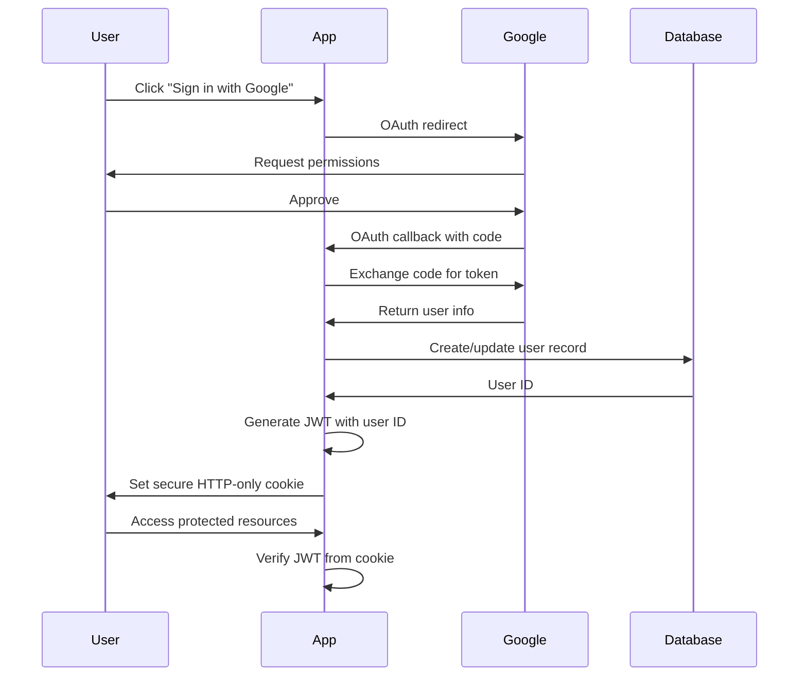

# Security Documentation - Hey Bagel

## Overview

Hey Bagel is a private journaling application with AI-powered insights. This document describes the security architecture, authentication flow, data isolation strategy, and how to report security issues.

**Last Updated:** Phase 3 Security Audit (January 2026)  
**Security Posture:** Strong - No critical vulnerabilities identified

---

## Authentication Architecture

### Technology Stack

- **Auth Library:** Auth.js v5 (NextAuth)
- **Provider:** Google OAuth 2.0
- **Session Strategy:** JWT (JSON Web Tokens)
- **Database:** Postgres (via Neon) for user and account storage

### Authentication Flow



### Session Management

**Session Type:** JWT (stateless)
**Cookie Settings:**
- `httpOnly: true` - Prevents JavaScript access
- `secure: true` - HTTPS only (Vercel default)
- `sameSite: 'lax'` - CSRF protection
- **Default expiration:** 30 days (Auth.js default)
- **Refresh:** Session refreshed on activity

**Token Contents:**
```typescript
{
  id: string,        // User ID from database
  email: string,     // User email
  name: string,      // User display name
  image: string,     // Profile picture URL
  iat: number,       // Issued at
  exp: number        // Expiration
}
```

---

## User Isolation Strategy

### Database-Level Isolation

**All user data is scoped by `user_id`:**

#### Tables with User Scoping
- `entries` - Journal entries (each has `user_id` foreign key)
- `insights` - AI-generated reflections (each has `user_id` foreign key)
- `users` - User accounts (Auth.js managed)
- `accounts` - OAuth account links (Auth.js managed)

#### Foreign Key Constraints
```sql
ALTER TABLE entries
  ADD CONSTRAINT entries_user_id_fkey 
  FOREIGN KEY (user_id) REFERENCES users(id) ON DELETE CASCADE;

ALTER TABLE insights
  ADD CONSTRAINT insights_user_id_fkey 
  FOREIGN KEY (user_id) REFERENCES users(id) ON DELETE CASCADE;
```

**Cascade Deletion:** If a user is deleted, all their entries and insights are automatically deleted.

### Application-Level Isolation

#### 1. Authentication Helper

**File:** `lib/auth/helpers.ts`

```typescript
export async function requireAuth(): Promise<string> {
  const session = await auth();
  
  if (!session?.user?.id) {
    throw new Error("Unauthorized: You must be signed in to perform this action");
  }
  
  return session.user.id;
}
```

**Used in:** All Server Actions that modify or read user data.

#### 2. Database Query Scoping

**Every database query includes user filtering:**

```typescript
// Example: Get entries for current user only
export async function getAllEntries(userId: string): Promise<Entry[]> {
  const sql = getDb();
  const rows = await sql<EntryRow[]>`
    SELECT * FROM entries
    WHERE user_id = ${userId}  // <-- User scoping
    ORDER BY date DESC
  `;
  return rows.map(rowToEntry);
}
```

**No query can access data without a valid `userId` parameter.**

#### 3. Route Protection

**Middleware:** `middleware.ts`

Protects all routes except:
- `/` (landing page)
- `/auth/signin`
- `/auth/error`
- Static assets (`/_next/static`, `/_next/image`, etc.)

Unauthenticated users are redirected to `/auth/signin?callbackUrl={originalPath}`

#### 4. Server Action Protection

All Server Actions use the `requireAuth()` helper:

```typescript
export async function createEntry(formData: FormData) {
  const userId = await requireAuth();  // <-- Auth check
  // ... rest of logic uses userId for scoping
}
```

**If unauthenticated:** Throws error → Returns `{ success: false, error: "Unauthorized" }`

---

## Security Features

### ✅ Implemented

| Feature | Status | Description |
|---------|--------|-------------|
| **OAuth Authentication** | ✅ | Google OAuth via Auth.js |
| **JWT Sessions** | ✅ | Stateless, secure JWT tokens |
| **HTTP-Only Cookies** | ✅ | Prevents XSS cookie theft |
| **HTTPS Enforcement** | ✅ | Vercel enforces HTTPS by default |
| **SQL Injection Prevention** | ✅ | Parameterized queries (postgres template literals) |
| **XSS Prevention** | ✅ | Next.js auto-escapes all dynamic content |
| **CSRF Protection** | ✅ | SameSite cookies + Auth.js CSRF tokens |
| **User Data Isolation** | ✅ | All queries scoped by `user_id` |
| **Route Protection** | ✅ | Middleware redirects unauthenticated users |
| **Server Action Auth** | ✅ | `requireAuth()` on all mutations |
| **Foreign Key Constraints** | ✅ | Cascade deletes for data integrity |
| **Error Handling** | ✅ | User-friendly errors, no internal details exposed |
| **Secure Headers** | ✅ | X-Frame-Options, X-Content-Type-Options, etc. |

### 🔄 Optional (Deferred)

| Feature | Status | Reason Deferred |
|---------|--------|----------------|
| **Postgres RLS** | 🔄 | Application-level checks are sufficient for MVP |
| **Rate Limiting** | 🔄 | OpenAI has built-in rate limits; monitor first |
| **Content Security Policy** | 🔄 | Next.js auto-escapes; add if embedding third-party scripts |
| **Two-Factor Auth** | 🔄 | Add if handling sensitive data beyond journal entries |
| **Account Deletion** | 🔄 | Cascade deletes exist; UI for self-service deletion not built |

---

## Threat Model & Mitigations

| Threat | Risk Level | Mitigation |
|--------|-----------|------------|
| **SQL Injection** | Very Low | Parameterized queries via postgres template literals |
| **Cross-User Data Access** | Very Low | `user_id` scoping in all queries + foreign keys |
| **XSS (Stored)** | Very Low | Next.js auto-escapes React components |
| **XSS (Reflected)** | Very Low | No query params rendered directly |
| **CSRF** | Low | SameSite cookies + Auth.js CSRF tokens |
| **Session Hijacking** | Low | HTTP-only + secure cookies + HTTPS |
| **Brute Force Login** | Low | Google OAuth handles rate limiting |
| **API Abuse (AI)** | Medium | OpenAI rate limits; consider app-level limits if abused |
| **Unauthorized API Access** | Very Low | All API routes use `requireAuth()` Server Actions |
| **Mass Data Exfiltration** | Very Low | User-scoped queries prevent bulk access |

**Overall Risk:** Low

---

## Data Privacy

### What We Store

| Data Type | Storage Location | Purpose |
|-----------|------------------|---------|
| **Email** | `users.email` | User identification, account recovery |
| **Name** | `users.name` | Display name in UI |
| **Profile Picture** | `users.image` | Avatar display (URL from Google) |
| **OAuth Tokens** | `accounts` table | Google OAuth refresh/access tokens (Auth.js) |
| **Journal Entries** | `entries.content` | User's private journal content |
| **AI Analysis** | `entries.ai_summary`, `ai_sentiment`, `ai_themes` | AI-generated insights |
| **Insights** | `insights.content` | Weekly/monthly reflections |

### What We Don't Store

- ❌ Passwords (OAuth only)
- ❌ Credit card information
- ❌ Social Security Numbers or government IDs
- ❌ Location data
- ❌ Device fingerprints
- ❌ Third-party cookies

### Third-Party Services

| Service | Purpose | Data Shared |
|---------|---------|-------------|
| **Google OAuth** | Authentication | Email, name, profile picture (with user consent) |
| **OpenAI** | AI insights | Journal entry content (not stored by OpenAI per policy) |
| **Neon (Postgres)** | Database hosting | All user data (encrypted at rest) |
| **Vercel** | Application hosting | HTTP requests, logs (no sensitive data in logs) |

---

## Access Control

### Who Can Access What

| Actor | Permissions |
|-------|------------|
| **User (Authenticated)** | Read/write/delete their own entries and insights only |
| **Unauthenticated Visitor** | Landing page only; redirected to sign-in for all other routes |
| **Other Users** | Cannot access any other user's data (blocked at database level) |
| **Admin** | No admin role exists; database access via Neon Console (restricted) |

### Database Access

- **Application:** Uses Postgres connection string with read/write privileges
- **Developers:** Neon Console access (should be restricted to necessary personnel)
- **Users:** No direct database access; all queries via application layer

---

## Incident Response

### If You Discover a Security Issue

**Please report responsibly:**

1. **Do NOT** open a public GitHub issue
2. Email: [Your security contact email - to be added]
3. Include:
   - Description of the vulnerability
   - Steps to reproduce
   - Potential impact
   - Any suggested fixes

**Response Timeline:**
- Initial response: Within 48 hours
- Triage: Within 1 week
- Fix timeline: Depends on severity (critical issues patched immediately)

### Security Checklist for New Features

Before merging any new feature:

- [ ] Does it access user data? → Add `requireAuth()` check
- [ ] Does it write to database? → Ensure `user_id` is included
- [ ] Does it accept user input? → Validate with Zod schema
- [ ] Does it render user content? → Verify React auto-escaping
- [ ] Does it expose an API route? → Protect with Server Action
- [ ] Does it handle auth state? → Test unauthenticated flow
- [ ] Does it query the database? → Use parameterized queries
- [ ] Could it leak data? → Review query scoping

---

## Compliance

### GDPR Considerations (EU Users)

- **Right to Access:** Users can view all their data in the app
- **Right to Deletion:** Cascade deletes implemented; self-service UI to be added
- **Right to Portability:** Export feature to be added (JSON/PDF)
- **Data Minimization:** Only collect email, name, and journal content
- **Consent:** Google OAuth consent screen explains data usage

**Note:** Full GDPR compliance requires legal review. This is not legal advice.

### OpenAI Data Policy

Per OpenAI's [API Data Usage Policy](https://openai.com/policies/api-data-usage-policies):
- API data is NOT used to train models (as of March 2023)
- Data is retained for 30 days for abuse monitoring, then deleted
- Zero Data Retention (ZDR) available for enterprise customers

**Hey Bagel uses:** Standard OpenAI API with default 30-day retention.

---

## Deployment Security (Vercel)

### Environment Variables

**Required secrets** (never commit to git):
```bash
DATABASE_URL=postgresql://...          # Neon Postgres connection string
GOOGLE_CLIENT_ID=...                   # Google OAuth client ID
GOOGLE_CLIENT_SECRET=...               # Google OAuth client secret
NEXTAUTH_SECRET=...                    # JWT signing secret (generate with openssl rand -base64 32)
NEXTAUTH_URL=https://yourdomain.com    # Production URL
OPENAI_API_KEY=sk-...                  # OpenAI API key
```

**Set in:** Vercel Dashboard → Project Settings → Environment Variables

### Vercel Security Features

- **HTTPS:** Enforced by default
- **DDoS Protection:** Cloudflare integration
- **Edge Network:** Distributed globally
- **Auto-Renewing SSL:** Let's Encrypt certificates
- **Secrets Management:** Encrypted environment variables

---

## Monitoring & Logging

### What We Log

**Application Logs:**
- ✅ Server Action execution times
- ✅ AI processing success/failure
- ✅ Database query errors
- ✅ Authentication failures

**What We DON'T Log:**
- ❌ Journal entry content
- ❌ Session tokens
- ❌ OAuth secrets
- ❌ User passwords (we don't have any)

**Log Location:** Vercel Dashboard → Logs (or local console in dev)

### Alerting (To Be Implemented)

Consider adding:
- OpenAI cost alerts (billing dashboard)
- Database connection pool exhaustion alerts (Neon dashboard)
- Auth failure spikes (potential attack)

---

## Development Security

### Local Development

**Required:**
- Never commit `.env.local` to git (already in `.gitignore`)
- Use test Google OAuth credentials for local dev
- Use separate Neon database branch for development

**Best Practices:**
- Regularly update dependencies: `npm audit`
- Review `npm audit` output before deploying
- Test auth flows in incognito mode
- Run Phase 3 verification tests before deployment

---

## Changelog

| Date | Change | Impact |
|------|--------|--------|
| Jan 2026 | Phase 1: Postgres migration | Database moved to Neon (multi-user ready) |
| Jan 2026 | Phase 2: Auth.js + Google OAuth | Authentication implemented |
| Jan 2026 | Phase 3: Security audit | Test endpoint removed, verification tests created |

---

## Additional Resources

- [Auth.js Documentation](https://authjs.dev/)
- [Next.js Security Best Practices](https://nextjs.org/docs/authentication)
- [OWASP Top 10](https://owasp.org/www-project-top-ten/)
- [Postgres Security](https://www.postgresql.org/docs/current/security.html)
- [Vercel Security](https://vercel.com/docs/security)

---

**Maintained by:** Hey Bagel Development Team  
**Review Frequency:** After each major feature or every 3 months  
**Last Security Audit:** Phase 3 (January 2026)


